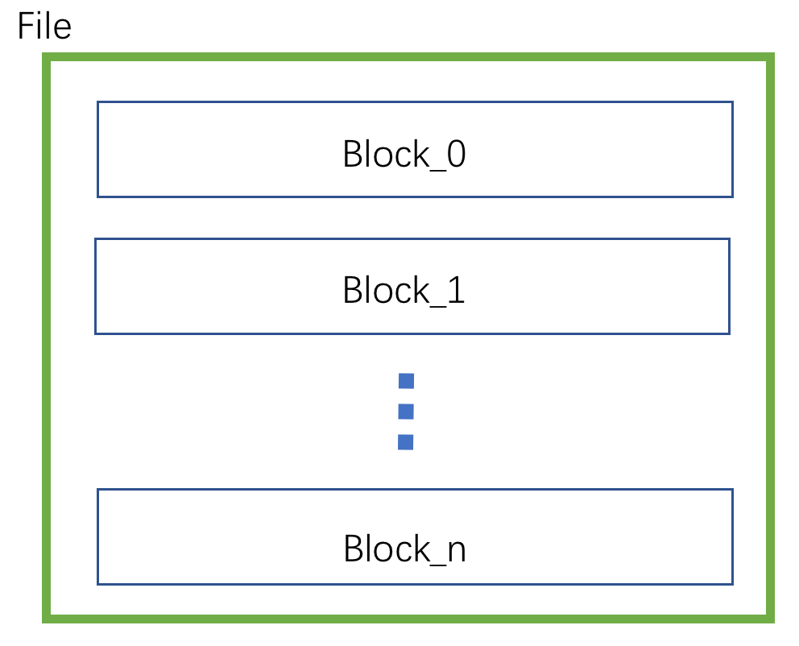

#### 本项目是课程设计，下面是选取的是报告的一部分

## 功能总览

- 支持三种数据类型: int， float， char(n) 1 ≤ n ≤ 255
- 支持数十列的表，支持主键定义和唯一值的限制
- 支持使用B+树为某一列建立索引
- 搜索或者删除时支持以下操作: =，<>，<，>， <=， >=。等于操作使用索引加速搜索
- 支持以下操作命令:
	- select
	- insert
	- delete
	- create table / index
	- drop table / index
	- exec / execfile (Execute a .sql file)
	- exit / quit
- 支持对外提供服务（仅仅实现了传输结果的字符串）

## 总体设计


该应用程序主要有7个部分组成，它们的名称以及作用分别是：

- BufferManager，缓冲区管理者。主要负责从磁盘加载需要的块到内存中，每一个块被包装成为一个块节点，缓冲区管理者使用一个循环双向链表表并管理这些块节点，当管理的块节点数量达到上限时，使用最近最久未使用算法（LRU）替换块节点。当将块节点换出时，如果块是脏的，那么缓冲区管理者还负责将数据写回磁盘。
- RecordManager，记录管理者。当有新的记录需要保存时，记录管理者将记录写入到Buffer中，交由BufferManager管理；当需要某一条记录时，使用BufferManager将对应的块读入内存，然后从块节点中读取数据。
- IndexManager，索引管理者。主要负责操作B+树，进行索引的创建，插入和搜索。
- CatalogManager，目录管理者。主要负责记录所有表的信息，信息包括表名、主键名、列名、列的类型和长度等，还记录索引的信息。
- API，对外提供接口。提供创建表、删除表、插入记录、搜索记录等接口并输出相应数据。
- Interpreter，解释器。负责将用户的字符串命令翻译为API可以接受的参数。
- Server，服务器模块。主要负责暴露出特定的端口供其他应用程序使用。

### 文件组织



将文件划分为相同大小`BlockSize`的块，当操作数据时，都是对一整个块进行磁盘的读出与写入。如果系统需要访问文件中块编号为`BlockId`的数据时，使用fseek函数可以快速找到对应块在文件中的位置，比如：

```
fseek(file, BlockSize * BlockId, SEEK_SET);
```

### 缓冲区管理设计


每一个文件的第一个块（编号为0的块）存放只存放数据描述信息，不存放具体记录（Record），存放的描述信息有，单个记录的长度、记录的总数量和位置靠前的被删除记录的位置。

文件除了第一个块之外，存放具体的记录（Record），每一个块可以存放多个Record，存放的数量`PerBlockRecordCount`由Record的长度`RecordLength`决定，数量计算公式为:

```
PerBlockRecordCount = BlockSize / RecordLength
```

获取`第n个`记录的步骤为：

1. 计算该记录在文件中编号为几的块上，计算公式为：

	```
	BlockId = n / PerBlockRecordCount + 1
	```
2. 计算该记录在块内的偏移`bias`，计算公式为：

	```
	bias = n % PerBlockRecordCount * RecordLength
	```
	


得到文件中块的位置后，由BufferManager负责从文件中读取该块一整块的数据到内存中。这一块的数据会被封装为块节点`BlockNode`，并组织成为一个双向循环链表进行管理，如图所示。之后就可以根据偏移量和记录长度获取到第n个记录。新的块节点或者最近被访问的节点会被放入到头节点之后，即表示最近被使用。块节点的数量有一个上限，当BufferManager发现数量达到上限时，会将靠近尾节点的块节点移除并根据需要写回磁盘，即表示最近最久未被使用的被移除内存。

### 目录管理设计


所有的表名单独使用一个文件来存储，如图所示，块中每一条记录由一对“表名-主键名”组成。该文件用来表示表目录，为主键是哪一列、表是否存在提供判断依据。


所有的索引信息单独使用一个文件来存储，块中每一条记录都有三个索引的描述信息组成，包括索引名、表名和列名组成，如图所示。当然每张表的主键都是需要建立索引的。


每一张表所包含的列也适用单独的一个文件存储，块中每一条记录由列名、列的类型或长度（在该系统中，1～255表示char类型，同时也表示其允许的最大长度，256表示int64_t类型）和唯一性标识组成，如图所示。唯一性标识用来保证对应列每一个数据的唯一性，同时为能否为该列建立索引提供判断依据。

### 记录管理设计


每一条Record的组成如图所示，它表示表中的一行数据，因为支持变长的列类型，所以图中小方框的长度不一致，同时为了能够删除数据，每一条Record的最后一位表示删除标识。当获取到一条记录时，如果需要获取指定列的值，就根据指定列在Record的起始位置和指定列的长度来获取。

### 索引管理设计


该程序使用B+树来减少搜索时间，B+树的每一个节点都存放了Size个关键字和对应的子节点（如果该节点不是叶子节点的话，即叶子节点标LeafFlag识为假），最多存放MAX\_KEY\_COUNT个关键字。一个节点在文件中的存放格式如图所示，当程序搜索时会将相应的索引加载到内存中。

### 解释器设计

为了方便用户与程序的交互，模仿SQL语句的交互模式设计了解释器，负责将用户输入的指令翻译成调用程序API所需的参数，主要设计的指令解释器有以下三个。

- CREATE TABLE 语句。其对应的有限状态自动机如下图所示，它可以接收形如以下的指令：

	```
	create table student (
			 id int,
			 name char(40),
			 primary key(id));
	```

	

- INSERT 语句。其对应的有限状态自动机如下图所示，它可以接收形如以下的指令：

	```
	insert into student values(1, "wangweisong");
	```
	
	

- SELECT 语句。其对应的有限状态自动机如下图所示，它可以接收形如以下的指令（条件语句只支持 and 逻辑）：

	```
	select id,name from student where id = 1 and name != "test" limit 10;
	```
	
	
	

为了使程序更加完整，还设计了DROP TABLE、EXECFILE和EXIT等小指令的解释器。

### 服务端设计


使用SOCKET，暴露宿主机的端口给外部应用程序，外部应用程序可以通过连接到该端口将命令发送到服务端执行并得到服务端返回的结果。服务端允许多个客户端接入，如图所示，但是服务端内部执行命令是串行的，从而保证表、索引结构、索引文件的一致性。

<div style="page-break-after:always"></div>

## 详细设计

下面对主要类的成员方法、重要的结构体进行阐述

### Block 结构体

```
struct Block {
    string filename; // 所属文件名
    int id;          // 块编号
    bool dirty;      // 是否是脏的
    bool pin;        // LRU策略标记
    char content[BLOCK_SIZE];
    Block(const char *_filename, int _id): filename(_filename), id(_id) {
        dirty = false;
        pin = false;
    }
};
```

### BlockNode 结构体

```
struct BlockNode {
    Block *block;    // 指向Block指针
    BlockNode *pre;  // 前一个节点
    BlockNode *nxt;  // 后一个节点

    BlockNode(Block *_block): block(_block) {}

    // 将该节点加入到node之后
    void add(BlockNode *node) {
        pre = node; nxt = node->nxt;
        node->nxt->pre = this; node->nxt = this;
    }
    // 自己从链表中移除
    void remove() { pre->nxt = nxt; nxt->pre = pre;}
    ~BlockNode() { remove(); }
};
```

### heapFile类

成员方法 | 说明
:-:|:-:
HeapFile(const char *_filename) | 构造函数，从文件中读取数据初始化heapFile实例
static void createFile(const char *_filename, int _recordLength) | 创建一个文件，在文件第0块处存放基本的信息
int getNextRecord(char *data) | 获取下一条记录并将数据写入到data指向的缓冲区中
const char *getRecordById(int id) | 获取第id个位置的一条记录，返回记录所在起始位置的指针
int addRecord(const char *data) | 将data中的数据写入到文件块中第一个为空的位置

### bufferManager类

成员方法 | 说明
:-:|:-:
Block *getBlock(const char *filename, int id) | 返回文件名和块的编号所确定一个块，若内存中没有，则首先从文件中读取
void deleteNodeBlock(BlockNode *node, bool write) | 从内存中移除一个块，若write为true，则将该块写入文件
Block *loadBlock(const char *filename, int id) | 加载指定的块到内存中
void writeBlock(const char *filename, int id) | 将一个块写回到文件原来的位置
void removeBlockByFilename(const char *filename) | 删除一个文件在内存中的所有的块，仅删除表时调用

### catalogManager 类

成员方法 | 说明
:-:|:-:
bool createTable(const char *tableName, const char *primary, const vector<string> *colName, const vector<short> *colType, vector<char> *colUnique) | 创建表时生成表的目录信息
Table *getTable(const char *tableName) const | 获取一张带有表的描述信息的Table实例
bool createIndex(const char *indexName, const char *tableName, const char *colName); | 创建索引时生成索引的目录信息
void getIndexByTable(const char *tableName, vector<Index*> *vec) | 获取一张表所有的索引信息

### recordManager 类

成员方法 | 说明
:-:|:-:
int select(const char *tableName, const vector<string> *colName,const vector<int> *cond, const vector<string> *operand,vector<char*> *record, vector<int> *ids) | 搜索一条记录
int insert(const char *tableName, const char *data) | 插入一条记录
bool createTable(const char *tableName) | 创建一张表
bool dropTable(const char *tableName) | 删除一张表
bool checkRecord(const char *record, const char *tableName, const vector<string> *colName, const vector<int> *cond, const vector<string> *operand); | 检查记录是否满足WHERE的条件

### indexManager 类

成员方法 | 说明
:-:|:-:
bool createIndex(const char *indexName) | 创建索引，是B+树创建索引的接口
bool dropIndex(const char *indexName) | 删除索引，是B+树删除索引的接口
bool insert(const char *indexName, const char *key, int value) | 插入一个新的键-值对，是B+树插入新数据的接口
int find(const char *indexName, const char *key) | 根据健寻找相应的值，是B+树寻找的接口

### bPulsTree 类

成员方法 | 说明
:-:|:-:
BPTree(const char *_filename) | 构造函数，从文件中读取数据初始化B+树
static void createFile(const char *_filename, int _keyLength, int _order = -1) | 创建存储B+树的索引文件
int find(const char *_key) | 根据key查找
bool add(const char *_key, int _value) | 添加一个键值对
bool remove(const char *_key) | 移除一个键值对

### bPlusTreeNode 类

成员方法 | 说明
:-:|:-:
BPTreeNode(const char *_filename, int _id, int _keyLength) | 构造函数，从文件中读取数据初始化B+树节点
BPTreeNode(const char *_filename, int _id, int _keyLength, bool _leaf, int firstPtr) | 构造函数，新生成一个B+树节点
int findPosition(const char *key) const | 在该节点中寻找key，如果有，返回它所在的位置
void insert(int pos, const char *key, int ptr) | 往该节点中插入一个键值对
BPTreeNode *split(int newId, char *newKey) | 该节点分割成两个，返回新的一个节点的指针
const char *borrow(BPTreeNode *sib, bool leftSib, const char *parentKey) | 从兄弟节点借一个元素
void mergeRight(BPTreeNode *sib, const char *parentKey) | 与右边的兄弟节点合并

### interpreter 类

成员方法 | 说明
:-:|:-:
void execute(const char *sql) | 执行输入的SQL指令
void createTable() | 解析 create table 指令
void select() | 解析 select 指令
void insert() | 解析 insert 指令
bool where(vector<string> *colName, vector<int> *cond, vector<string> *operand) | 解析 where 指令
void execfile() |  从文件中读取指令执行

### api 类

成员方法 | 说明
:-:|:-:
int select(const char *tableName, const vector<string> *colName, const vector<string> *selectColName, const vector<int> *cond, const vector<string> *operand, int limit) | 搜索需要的记录
bool insert(const char* tableName, const vector<string>* value) | 插入一条新的记录
bool createTable(const char *tableName, const char *primary, const vector<string> *colName, const vector<short> *colType, vector<char> *colUnique) | 创建一张表
int filter(const char *tableName, const vector<string> *colName, const vector<int> *cond, const vector<string> *operand, vector<char*> *record, vector<int> *ids) | 根据搜索条件进行过滤

### server 类

成员方法 | 说明
:-:|:-:
Server(Interpreter *interpreter) | 构造方法，初始化SOCKET，绑定到指定端口，启动服务
void start() | 监听端口，处理外部应用程序的请求，作为外部应用程序与系统通信的中间者

<div style="page-break-after:always"></div>

## 测试

### 测试数据

测试数据使用python随机生成，使用代码如下图所示。代码第3-9行首先生成创建表语句，其中字段有id、col\_1、col\_2...col\_99共100个字段，其中主键是id；代码11-18行生成200,000条插入指令，除主键外其余数据随机在0-100,000取值。


生成的数据部分截图如下所示。


### 测试环境

本地Mac OS和系统为CentOS 7的虚拟机，编译标准为C++11

### 测试过程

1. 运行Python程序生成测试数据文件"test.sql"

	
	
2. make编译为可执行文件，也可以用CMake工具编译

	
	
3. 交互模式运行程序并执行测试文件的命令，其中CREATE TABLE命令一条，INSERT INTO命令20万条

	


4. 搜索存入的结果，因为结果过多，使用LIMIT子命令限制输出的数量

	- 不带WHERE命令

		
	
	- 指定列并且带有WHERE命令
		
		

5. 服务模块测试，启动服务后，外部应用程序使用SOKCET连接到指定地址和端口执行命令

	- 启动一个简单SOCKT程序，连接到服务端执行命令，该客户端程序运行在系统为CentOS 7的虚拟机中
	
		
		
		
	- 使用"-d"参数启动服务端，处理接收到的命令，该服务端程序运行在本机MacOS中

		

6. 数据存放目录结构，包括存储的目录文件、索引文件和数据文件

	
	
7. 错误命令测试

	
	
8. 重复插入测试。因为id是主键，所以在id列上建立了索引，插入与已有id相同的数据测试

	
	
9. 插入数据类型错误测试。将插入的数据第二列更改为char类型的数据，结果如下图

	
	
10. 退出应用程序

	
		
### 测试结果

测试用例覆盖了主要的要求，基本实现以下几点:

- 能够创建一张表并往表中添加数据
- 能够带条件地进行搜索
- 能搜使用索引加速搜索
- 所有数据能够存储在文件中供下一次程序启动使用
- 提供了供外部应用程序使用的接口

测试结果反映出解释器能够解析正确的指令并能够发现错误指令。在搜索方面，展现出了良好的搜索效率和正确性。在插入数据方面，在能够将数据存放到正确的位置的前提下，能够检测出不允许重复的值和类型错误的值。

但测试过程中仍然发现了存在很多的缺陷。例如插入功能，理论上能够存放100万条记录，但是插入的过程中，插入大量数据会耗费大量的时间，插入20万条花费时间近一个小时，分析原因可能是没有批量插入功能，所以每次插入一条新的数据就会更新一次数据块和索引，从而导致频繁的检查和磁盘I/O。再比如服务端/客户端程序实现较简陋，传送的数据可能会丢失，分析原因可能是POLL系统调用错误导致的缓冲区覆盖。

尽管允许多个客户端同时操作该应用程序，对客户来说是并行执行的，但是应用程序内部是以单线程串行执行的，所以该应用程序未能实现以多线程的方式运行的要求。
	


